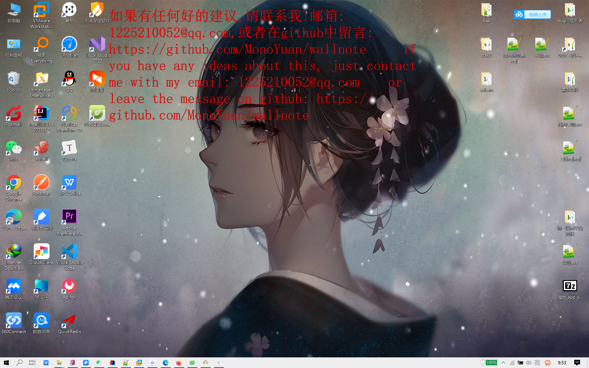
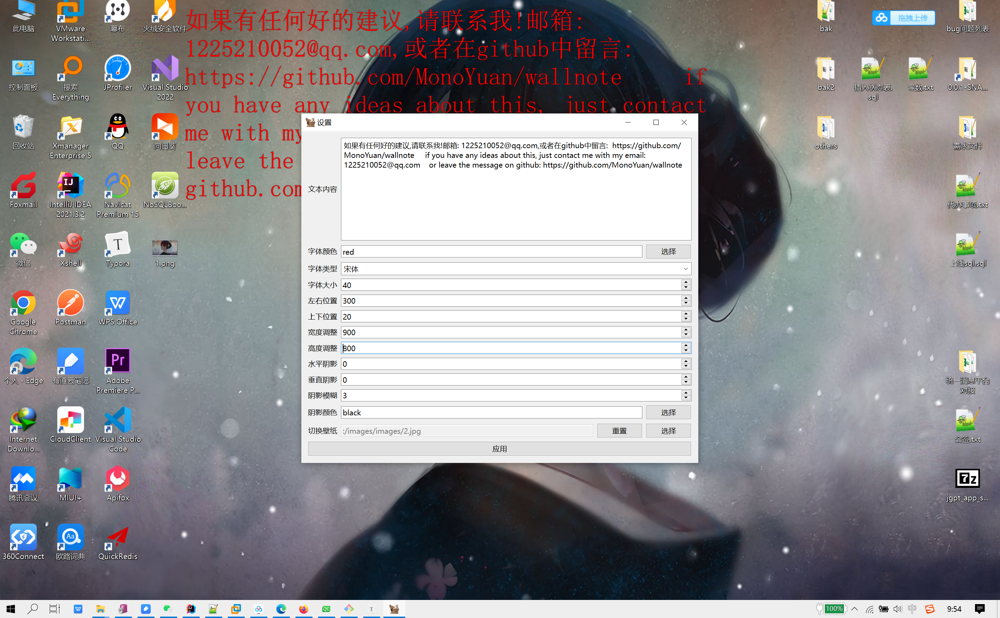

# wallnote

### 开发灵感

桌面是程序员每日都要面对的东西, 如果在桌面上记录一些便签, 备忘录, 或者一些重要的内容, 甚至是记录单词, 一些知识点, 即可在不知不觉中记住这些东西。我尝试了敬业签，透明便签等， 使用都不尽如人意，所以决定自己开发一个桌面便签。

本人是一个java程序员，奈何java在这方面根本不擅长，就学了一些C++和QT的知识，然后用QT做出来了这个桌面便签。

功能上基本能达到自己的要求。

在target/windows目录下已经打包了windows下的可执行文件，本人只有windows10的电脑，没有在macOS, Linux上编译过，不知道兼容性如何

### 桌面便签展示图

设置页面图

可以在设置windows系统托盘中打开设置